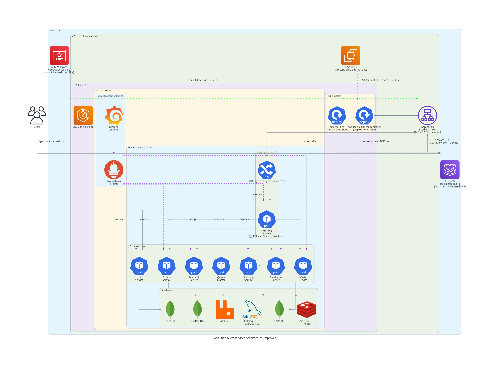
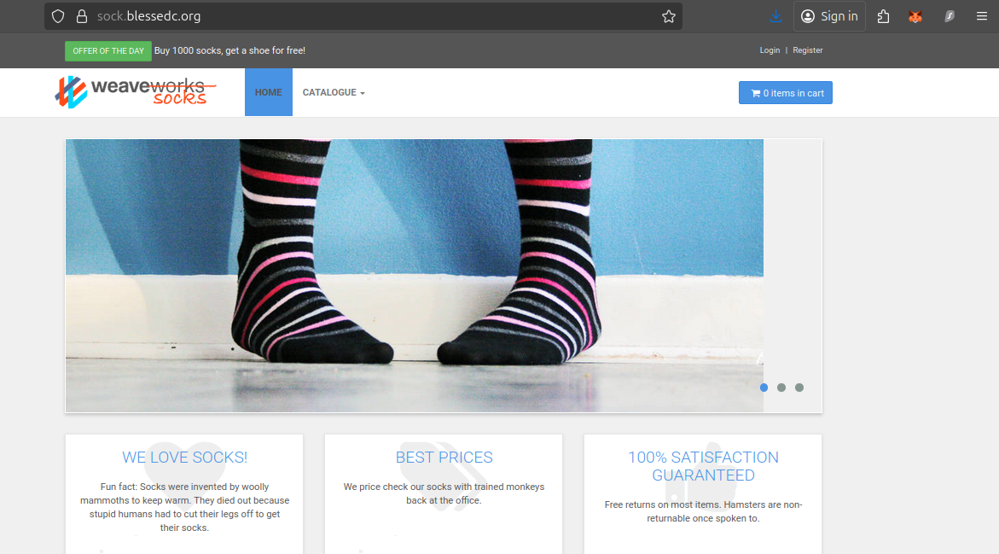
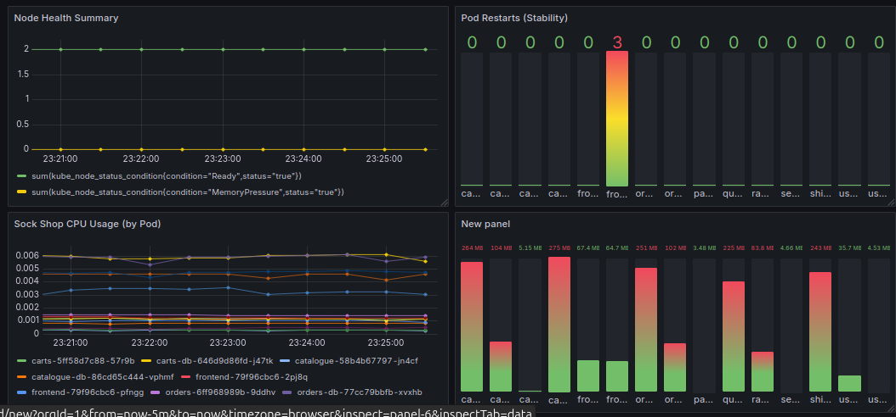

#  AWS EKS + Helm — Microservices Deployment of the Sock Shop Application

###  Production-grade Kubernetes infrastructure with Terraform, Helm, AWS ALB, Route53, ACM, ExternalDNS, Prometheus, and Grafana

---

## Setup Instructions / Prerequisites

Before you begin, ensure you have the following tools and AWS configurations in place.

### **Local Machine Requirements**
| Tool | Description | Version |
|-------|--------------|----------|
| **Terraform** | Infrastructure provisioning | ≥ 1.5 |
| **AWS CLI** | Interacts with AWS resources | ≥ 2.0 |
| **kubectl** | Manages the EKS cluster | ≥ 1.29 |
| **Helm** | Deploys charts to Kubernetes | ≥ 3.12 |
| **OpenSSL** | Used for key and certificate verification | latest |

Install them via:
```bash
sudo apt update
sudo apt install -y terraform awscli kubectl
curl https://raw.githubusercontent.com/helm/helm/main/scripts/get-helm-3 | bash
```
Configure AWS locally by running 
```bash
aws configure
```
and input the neccesary credentials

---

##  Overview

This project demonstrates the deployment of the **Sock Shop microservices application** on **Amazon EKS (Elastic Kubernetes Service)** using **Terraform** and **Helm**.  

The goal was to build a **fully automated, production-ready Kubernetes environment** with:
- Infrastructure-as-Code (Terraform)
- Automated DNS and HTTPS provisioning
- Centralized monitoring and visualization
- Proper separation of internal and external workloads  

This project was developed as part of my **Cloud/DevOps Engineering journey**, showcasing skills in **Infrastructure automation, Kubernetes orchestration, observability, and AWS cloud design**.

---

### Key Components

| Layer | Component | Description |
|--------|------------|-------------|
| **Infrastructure** | **Terraform** | Automates the provisioning of VPC, subnets, route tables, security groups, IAM roles, and the EKS cluster. |
| | **EKS Cluster** | Hosts the Sock Shop microservices and monitoring stack. |
| | **Route53** | Manages DNS for `sock.blessedc.org` and related subdomains via ExternalDNS. |
| | **ACM (AWS Certificate Manager)** | Provides wildcard TLS certificate (`*.blessedc.org`) for HTTPS termination at the ALB. |
| **Ingress Layer** | **AWS ALB Ingress Controller** | Handles ingress traffic and load balancing for public endpoints. |
| | **ExternalDNS** | Automatically creates and updates Route53 DNS records based on Kubernetes Ingress resources. |
| **Application Layer** | **Sock Shop Microservices** | A polyglot demo microservices app (frontend, user, catalogue, orders, payment, shipping, etc.). |
| | **Helm** | Used for packaging and deploying Sock Shop and monitoring stack into namespaces. |
| **Monitoring Layer** | **Prometheus** | Collects metrics from Kubernetes components and workloads. |
| | **Grafana** | Visualizes cluster and app metrics with custom dashboards. |
| **Security Layer** | **IRSA (IAM Roles for Service Accounts)** | Grants least-privilege IAM permissions to pods like `external-dns` and `aws-load-balancer-controller`. |

---

## Domain & Routing

- **Primary domain:** `sock.blessedc.org`
- **Subdomains:**
  - `sock.blessedc.org` → Frontend (public-facing)
  - `grafana.sock.blessedc.org` → Grafana dashboard (secured)
  - `prometheus.sock.blessedc.org` → Prometheus UI (secured)

Traffic Flow:
User → Route53 (A Record) → ALB → Ingress → Frontend Service → Backend ClusterIP Services


---

## Deployment Workflow

###  Infrastructure Provisioning (Terraform)

Terraform provisions:
- VPC (public + private subnets)
- Internet Gateway, NAT Gateway, route tables
- EKS cluster and node groups
- IAM roles for:
  - ALB Ingress Controller
  - ExternalDNS
  - Node group policies
- ACM certificate for HTTPS
- Route53 hosted zone

```bash
terraform init
terraform apply -auto-approve
```

### Connecting kubectl to EKS

Once the cluster is up:
```bash
aws eks --region us-east-1 update-kubeconfig --name sockshop-cluster
kubectl get nodes
```
### Helm Deployments (Application & Monitoring)
Sock Shop Deployment  
```bash
cd sock-shop
helm install sock-shop -n sock-shop --create-namespace
```
Monitoring Stack (Prometheus + Grafana)  
```bash
helm repo add prometheus-community https://prometheus-community.github.io/helm-charts
helm repo update
helm install monitoring prometheus-community/kube-prometheus-stack -n monitoring --create-namespace
kubectl apply -f grafana-ingress.yaml -n monitoring
kubectl apply -f prometheus-ingress.yaml -n monitoring
```
### Automated DNS and HTTPS
- ExternalDNS updates the A record for sock.blessedc.org automatically.
- ACM certificate handles HTTPS at the ALB level.
- HTTP requests are redirected to HTTPS via ALB annotation.

### Monitoring & Dashboards
Grafana visualizes:
- Pod CPU & Memory usage
- Node health and cluster capacity
- Service uptime and restart count
- Prometheus scrape targets
- Sock Shop microservices performance (frontend, catalogue, orders, etc.)

### Challenges & Lessons Learned
| Challenge                                | Solution                                                                                               |
| ---------------------------------------- | ------------------------------------------------------------------------------------------------------ |
| **IAM Permission Errors (AccessDenied)** | Created specific IAM policies for `aws-load-balancer-controller` and `external-dns` using IRSA.        |
| **Ingress not resolving ALB hostname**   | Fixed by adding proper `ingressClassName` and correct certificate ARN in annotations.                  |
| **Hosted zone deletion issues**          | Learned that Route53 zones can’t be deleted if non-default records exist — cleaned manually.           |
| **TLS and DNS automation confusion**     | Simplified with Terraform-provisioned ACM + ExternalDNS automation.                                    |
| **Grafana exposure via ALB**             | Created separate Ingress and subdomains (`grafana.sock.blessedc.org`, `prometheus.sock.blessedc.org`). |


### Lessons Learned
1. Understanding AWS networking (VPC, subnets, routing) is crucial before deploying EKS.
2. Ingress controllers are central to production traffic flow; configuring them securely matters.
3. IRSA (IAM Roles for Service Accounts) provides fine-grained access without giving broad node IAM roles.
4. Automating DNS and SSL reduces manual ops and improves reproducibility.
5. Monitoring is not an afterthought — observability should be built into every environment.

### Summary
This project demonstrates how to design and deploy a secure, scalable, observable microservices architecture on AWS, using Terraform for infrastructure, Helm for Kubernetes deployments, and modern DevOps best practices for automation, monitoring, and reliability.

##  Architecture Overview



## Demos


